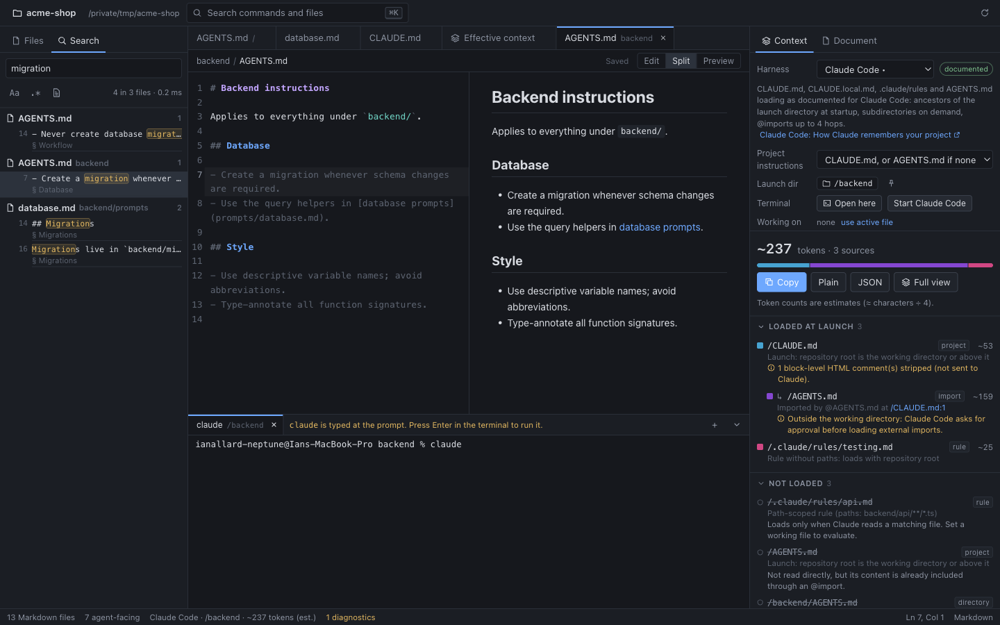
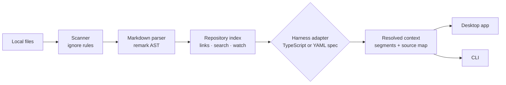

<div align="center">

# ContextMD

**See exactly what your AI coding agent sees.**

A local-first desktop IDE that shows which `AGENTS.md` / `CLAUDE.md` / rules files your agent
loads, in what order, what they cost in tokens, and where they contradict each other.

[](https://github.com/IanAllNep/contextmd/actions/workflows/ci.yml)
[](LICENSE)


[Why](#why) · [Screenshots](#screenshots) · [Supported agents](#supported-agents) ·
[Quick start](#quick-start) · [How it works](#how-it-works) · [Docs](#documentation)


</div>

## Why

Coding agents get much of their behavior from Markdown: `AGENTS.md`, `CLAUDE.md`, nested
per-directory instructions, rules, skills and `@imports`. Those files are effectively **source
code for agent behavior**, but you can't see them the way the agent does.

ContextMD answers the questions you actually have when an agent misbehaves:

| Question                                                          | ContextMD shows                                             |
| ----------------------------------------------------------------- | ----------------------------------------------------------- |
| Which files does the agent load when it starts in `backend/api/`? | The ordered list of sources, per harness                    |
| Why is my instruction being ignored?                              | Files that exist but are **not loaded**, with the reason    |
| Where did this line come from?                                    | Line-level provenance: click any line to jump to its source |
| How much does this cost before I type anything?                   | Token estimates per file and in total                       |
| Do my instructions contradict each other?                         | Duplicate and potential-conflict diagnostics                |

### Example

In the bundled [example project](examples/example-agent-project), the generic view of
`backend/prompts/database.md` looks like this:

```text
/AGENTS.md                        project     ~159 tokens
/CLAUDE.md                        project      ~80
/backend/AGENTS.md                directory    ~78
/backend/prompts/database.md      target       ~82
──────────────────────────────────────────────────────
Effective context (Generic)                   ~399 tokens (estimate)

⚠ Potential conflict (heuristic)
  /AGENTS.md:14          “Never create database migrations automatically.”
  /backend/AGENTS.md:7   “Create a migration whenever schema changes are required.”
```

Switch the harness to **Claude Code** and the story changes. With default settings,
`/backend/AGENTS.md` is **never loaded**, because a `CLAUDE.md` exists at the root. The root
`AGENTS.md` only arrives through `CLAUDE.md`'s `@AGENTS.md` import. Surfacing findings like this
one is the point of ContextMD.

## Screenshots

<table>
  <tr>
    <td width="50%" valign="top">
      
      <p><b>Harness-specific resolution.</b> Under Claude Code, <code>backend/AGENTS.md</code> is not loaded, and the panel says why.</p>
    </td>
    <td width="50%" valign="top">
      
      <p><b>Diagnostics.</b> Per-source token estimates and a potential conflict between root and <code>backend/</code> instructions.</p>
    </td>
  </tr>
  <tr>
    <td width="50%" valign="top">
      
      <p><b>Line-level provenance.</b> Every line of the concatenated context maps back to its file and line.</p>
    </td>
    <td width="50%" valign="top">
      
      <p><b>Start the agent where the context applies.</b> <code>claude</code> is typed in the launch directory. Nothing runs until you press Enter.</p>
    </td>
  </tr>
</table>

<details>
<summary>More: search and command palette</summary>


</details>

## Features

**Effective context**

- Pick a launch directory (and optionally the file the agent works on) and see the ordered
  sources that reach the agent, with token estimates
- Files that exist but aren't loaded, with the reason: fallback rules, one file per directory,
  byte budgets, path-scoped rules
- Line-level provenance view; copy or export as Markdown, plain text or JSON with
  `<!-- SOURCE: … -->` boundaries
- Diagnostics: duplicated instructions, plus potential conflicts (an experimental heuristic that
  can be switched off)

**IDE**

- CodeMirror editor, safe preview and split view, outline, metadata, links and **backlinks**
- Fast repository-wide search with file, section, line and snippet
- Command palette (`⌘K`), quick open (`⌘P`), keyboard-first, dark and light themes
- **Conflict-safe saving**: it never overwrites a file that changed on disk; you get a diff
  instead. External edits are picked up live.

**Terminal**

- Embedded terminal (xterm.js + node-pty) in the launch directory, with tabs, `` Ctrl+` `` to toggle
- **Start ‹agent›** types `claude`, `codex`, `gemini`, … at the prompt without running it

**Extensible and headless**

- Describe any agent in YAML with [harness specs](docs/harness-specs.md), in your harness folder
  or in `.contextmd/harnesses/` in a repository. No code needed.
- CLI: `contextmd scan | context | search | harnesses`, for scripts, CI and agents

## Supported agents

| Harness                | How it discovers instructions                                                                                                               | Fidelity   | Start command  |
| ---------------------- | ------------------------------------------------------------------------------------------------------------------------------------------- | ---------- | -------------- |
| **Claude Code**        | `CLAUDE.md` / `CLAUDE.local.md` root → cwd, `@imports` (4 hops), `.claude/rules` with `paths`, AGENTS.md fallback, subdirectories on demand | documented | `claude`       |
| **Codex CLI**          | `AGENTS.override.md` / `AGENTS.md` git root → cwd, one per directory, 32 KiB budget                                                         | documented | `codex`        |
| **Gemini CLI**         | `GEMINI.md` git root → cwd (all names), `@imports` (5), just-in-time subdirectories                                                         | documented | `gemini`       |
| **Amp**                | `AGENTS.md`, else `AGENT.md` / `CLAUDE.md`, parents + subtrees, `@` mentions                                                                | documented | `amp`          |
| **GitHub Copilot CLI** | `copilot-instructions.md`, `AGENTS.md`, `CLAUDE.md`, `GEMINI.md` combined; `applyTo` instructions                                           | documented | `copilot`      |
| **OpenCode**           | Nearest `AGENTS.md`, else `CLAUDE.md`                                                                                                       | documented | `opencode`     |
| **Cursor CLI**         | Root `AGENTS.md` + `CLAUDE.md`, `.cursor/rules/*.mdc` (alwaysApply / globs)                                                                 | documented | `cursor-agent` |
| **Aider**              | Nothing automatic; `read:` entries in `.aider.conf.yml`                                                                                     | documented | `aider`        |
| **Generic**            | ContextMD's own tool-neutral model                                                                                                          | heuristic  | none           |
| **Your own**           | Any [harness spec](docs/harness-specs.md)                                                                                                   | declared   | from your spec |

_Documented_ means the adapter follows the vendor's published docs, checked on the date in
[harness-semantics.md](docs/harness-semantics.md). Anything the docs leave open is shown in the
app as a note rather than guessed. Files outside the opened folder (for example
`~/.claude/CLAUDE.md`) are listed but not read.

## Quick start

Requires Node.js ≥ 22.12 and npm ≥ 10. Runs on macOS, Linux and Windows.

```bash
git clone https://github.com/IanAllNep/contextmd.git && cd contextmd
npm install
npm run dev
```

Then choose **Open repository…**, or **Open example project** to explore the bundled demo. To
open a folder directly, run `CONTEXTMD_OPEN=/path/to/repo npm run dev`.

<details>
<summary>CLI</summary>

```bash
npm run build -w @contextmd/cli
node packages/cli/dist/cli.js harnesses examples/example-agent-project
node packages/cli/dist/cli.js context examples/example-agent-project --adapter claude-code --file backend/api/handler.ts
node packages/cli/dist/cli.js context examples/example-agent-project --cwd backend --format markdown
node packages/cli/dist/cli.js search "migration" examples/example-agent-project
```

</details>

<details>
<summary>Development and quality checks</summary>

```bash
npm test             # unit + integration tests (Vitest)
npm run check        # typecheck + lint + test + build
npm run smoke        # drives the built Electron app with Playwright (after npm run build)
npm run screenshots  # regenerates docs/screenshots (after npm run build; GIF needs ffmpeg)
```

If Electron or the terminal fails to start after install (some npm setups skip install
scripts), run `node scripts/ensure-native.mjs`. On Linux, the terminal's native module compiles
during install and needs `make` and a C++ compiler.

</details>

## How it works



- [`packages/core`](packages/core): a UI-independent library covering scanning, parsing,
  indexing, search, harness adapters and diagnostics
- [`packages/cli`](packages/cli): the headless CLI on the same core
- [`apps/desktop`](apps/desktop): Electron + React. The main process owns the filesystem and
  terminals; the sandboxed renderer only sees a typed API.

**Built with:** TypeScript · Electron · React · Zustand · CodeMirror 6 · remark (Markdown AST) ·
xterm.js · node-pty · Vitest · Playwright · GitHub Actions (macOS + Linux CI)

## Engineering highlights

- **Monorepo with a UI-independent core.** Scanning, parsing, indexing, search and harness logic
  live in `@contextmd/core`, shared by the Electron app and a headless CLI.
- **Pluggable harness adapters.** Claude Code and Codex CLI loading rules are modeled from their
  documented semantics (imports, fallbacks, byte budgets), each with sources in
  [docs/harness-semantics.md](docs/harness-semantics.md). Six more terminal agents are
  **declarative YAML specs** run by a generic engine, which a test checks against the
  hand-written Codex adapter.
- **Embedded terminal with a safe "start agent" flow.** The command is resolved in the main
  process and typed but never run for you, and repository-supplied specs can't define commands.
- **Security-first desktop architecture.** Sandboxed renderer behind a typed IPC API, strict CSP,
  path-traversal and symlink checks, and Markdown treated as untrusted input.
- **Conflict-safe editing.** Incremental file watching, and saves that never clobber a file
  changed on disk; you get a diff instead.
- **Tested end to end.** Vitest unit and integration tests, a Playwright smoke test that drives
  the built Electron app (including the terminal), and CI on macOS and Linux.

## Privacy and security

- **Local only.** There is no telemetry, no account, no API key, and no network access except
  links you click.
- **Nothing runs on its own.** Opening a repository never executes scripts, hooks, MCP servers
  or commands from Markdown. The terminal starts only when you click, and agent commands are
  typed, not run.
- **Untrusted input stays contained.** Raw HTML in Markdown is shown as text, images aren't
  loaded, and a strict CSP applies. Repository harness specs are data: they can't define
  commands or replace built-in harnesses.
- **Sandboxed renderer.** All file access goes through the main process, which rejects paths
  outside the opened repository, including through symlinks.

## Roadmap

- [x] Effective context with provenance for 8 agents, plus user-defined harnesses
- [x] Embedded terminal with "start agent here"
- [ ] Opt-in reading of user-level files (`~/.claude/CLAUDE.md`, `~/.codex/AGENTS.md`)
- [ ] Context diff between git branches: "what does this PR change for the agent?"
- [ ] Per-model tokenizers and context budget warnings
- [ ] Packaged installers and a VS Code extension on the same core
- [ ] Optional AI-assisted explanations (never required)

## Documentation

| Document                                                                                                         | What's in it                                                            |
| ---------------------------------------------------------------------------------------------------------------- | ----------------------------------------------------------------------- |
| [Architecture](docs/architecture.md)                                                                             | Pipeline, data model, IPC, watching, security                           |
| [Harness specs](docs/harness-specs.md)                                                                           | Writing your own agent definition in YAML/JSON                          |
| [Harness semantics](docs/harness-semantics.md)                                                                   | What each built-in adapter is based on, with sources and open questions |
| [ADR 0001](docs/adr/0001-runtime-and-stack.md) · [ADR 0002](docs/adr/0002-declarative-harnesses-and-terminal.md) | Why Electron; declarative harnesses and the terminal                    |
| [Progress](docs/progress.md)                                                                                     | Current state, limitations and next steps                               |

## Contributing

Contributions are welcome. See [CONTRIBUTING.md](CONTRIBUTING.md). New harnesses need sources:
see [harness-semantics.md](docs/harness-semantics.md).

## License

[MIT](LICENSE)
