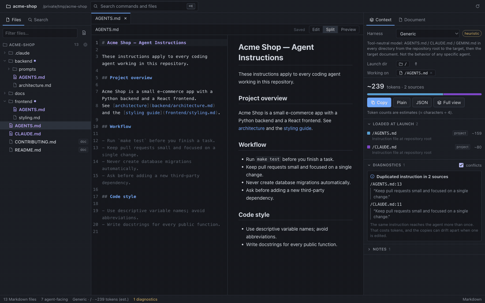
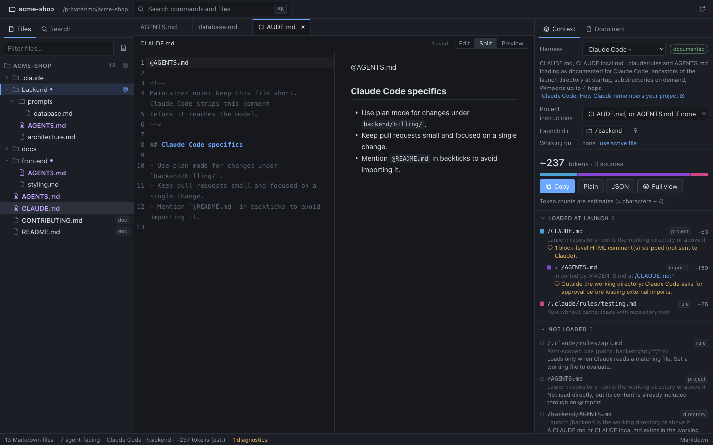
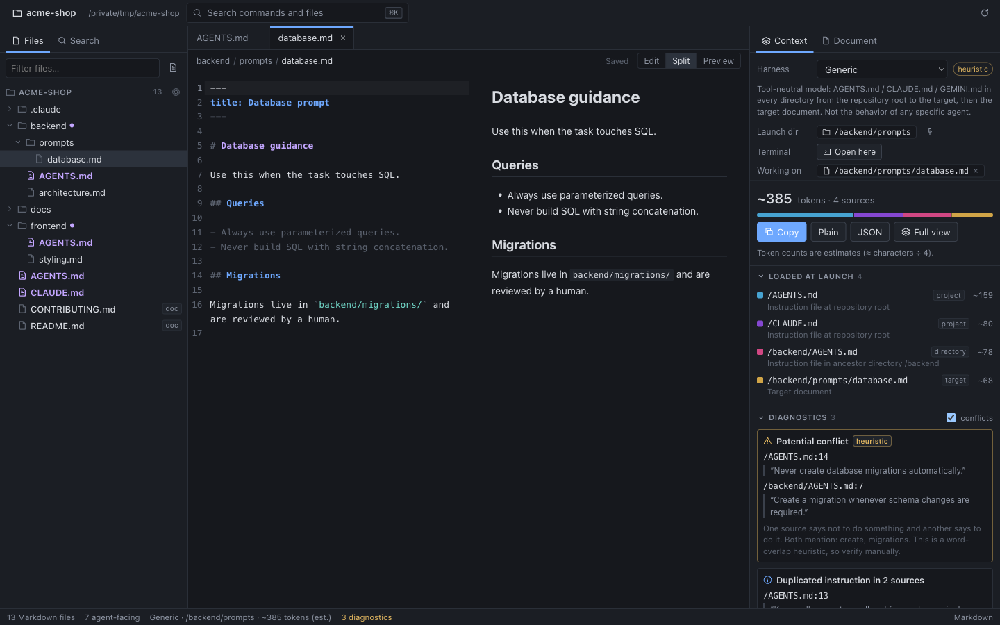
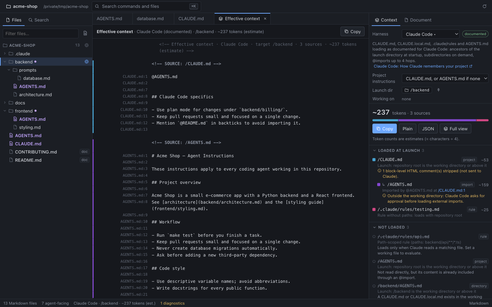
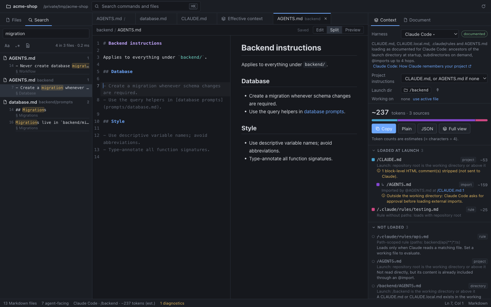
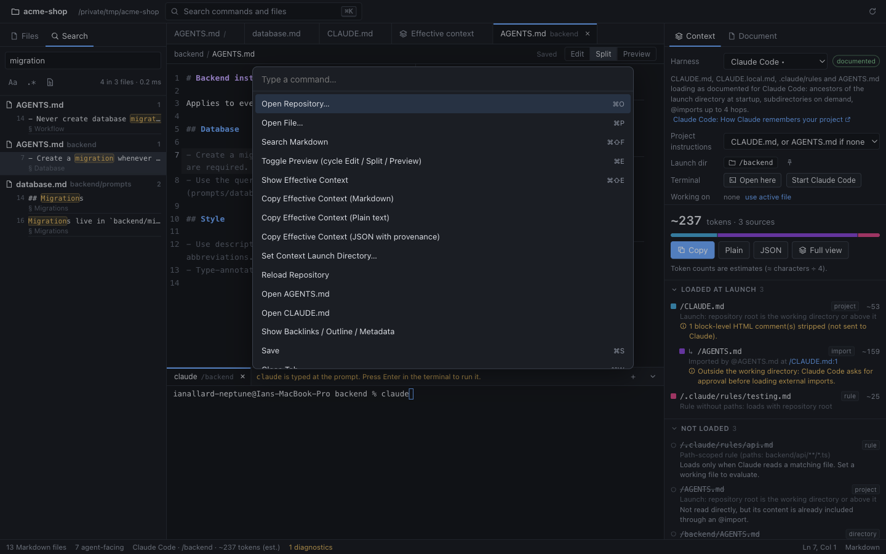

# ContextMD

[](https://github.com/IanAllNep/contextmd/actions/workflows/ci.yml)
[](LICENSE)


> A local-first desktop IDE that shows you exactly what your AI coding agent sees: which
> `AGENTS.md` / `CLAUDE.md` / rules files it loads, in what order, what they cost in tokens, and
> where they contradict each other.

**Built with:** TypeScript · Electron · React · Zustand · CodeMirror 6 · remark (Markdown AST) ·
Vitest · Playwright · GitHub Actions (macOS + Linux CI)



## The problem

Coding agents like Claude Code, Codex, Gemini CLI, Cursor and Copilot get much of their behavior
from Markdown files: `AGENTS.md`, `CLAUDE.md`, nested per-directory instructions, rules, skills,
prompt files and imports. These files work like **source code for agent behavior**, but you can't
see them the way the agent does.

- Which files does the agent actually load when it starts in `backend/api/`?
- In what order, and which one "wins"?
- Where did this instruction come from?
- How many tokens does all of this cost before you type a word?
- Do two files contradict each other?

## What ContextMD does

It opens a local repository, finds every Markdown and instruction file, and shows the
**effective context** for any directory or file. Every line is traced back to its source.

```text
/AGENTS.md                        project     ~159 tokens
/CLAUDE.md                        project      ~80
/backend/AGENTS.md                directory    ~78
/backend/prompts/database.md      target       ~82
──────────────────────────────────────────────────────
Effective context (Generic)                   ~399 tokens (estimate)

⚠ Potential conflict (heuristic)
  /AGENTS.md:14          “Never create database migrations automatically.”
  /backend/AGENTS.md:7   “Create a migration whenever schema changes are required.”
```

Switch the harness to **Claude Code** and the same repository tells a different story. With the
default settings, `/backend/AGENTS.md` is **never loaded**, because a `CLAUDE.md` exists at the
root. `AGENTS.md` reaches Claude only because `CLAUDE.md` imports it with `@AGENTS.md`.
ContextMD's job is to surface findings like that one.

## Screenshots

**Claude Code view.** With a root `CLAUDE.md`, Claude never reads `backend/AGENTS.md`. `AGENTS.md`
arrives only through the `@AGENTS.md` import, and the HTML comment is stripped before Claude
sees it.



**Generic view with diagnostics.** Four sources, per-source token estimates, and a potential
conflict between the root and `backend/` instructions.



**Line-level provenance.** Every line of the concatenated context maps back to its source file
and line. Click a line to jump there.



<details>
<summary>More: search and command palette</summary>




</details>

Regenerate these with `npm run build && npm run screenshots`.

## Engineering highlights

- **Monorepo with a UI-independent core.** Scanning, parsing, indexing, search and harness logic
  live in `@contextmd/core`, shared by the Electron app and a headless CLI.
- **Pluggable harness adapters.** Claude Code and Codex CLI loading rules are modeled from their
  documented semantics (imports, fallbacks, byte budgets), each with sources in
  [docs/harness-semantics.md](docs/harness-semantics.md).
- **Security-first desktop architecture.** Sandboxed renderer behind a typed IPC API, strict CSP,
  path-traversal and symlink checks, and Markdown treated as untrusted input.
- **Conflict-safe editing.** Incremental file watching, and saves that never clobber a file
  changed on disk; you get a diff instead.
- **Tested end to end.** Vitest unit/integration tests, a Playwright smoke test that drives the
  built Electron app, and CI on macOS and Linux.

## Features

Status labels: ✅ implemented · 🧪 experimental · 🗺️ roadmap

**Repository**

- ✅ Open any local folder; recent repositories remembered locally; no account, no network
- ✅ Discovers `.md`, `.markdown`, `.mdx`, `.mdc`; skips `.git`, `node_modules`, `dist`, `build`,
  `.next`, `target`, `vendor`, … and honours nested `.gitignore` files
- ✅ Recognizes `AGENTS.md`, `CLAUDE.md`, `CLAUDE.local.md`, `GEMINI.md`, `AGENTS.override.md`,
  Copilot instructions, `.claude/rules|skills|commands|agents`, Cursor rules, `README`,
  `CONTRIBUTING` (easy to extend: [`classify.ts`](packages/core/src/scan/classify.ts))
- ✅ File watching: external adds, edits and deletes update the tree and index incrementally

**Editing**

- ✅ CodeMirror editor, safe rendered preview, split view
- ✅ Save writes to disk. Saving is **conflict-safe**: it never overwrites a file that changed on
  disk since you loaded it. You get a diff and choose.
- ✅ External changes reload clean buffers. Dirty buffers get a banner, and deleted files keep
  their buffer.

**Understanding**

- ✅ Outline (click to navigate), metadata (words, chars, **estimated** tokens, links, mtime,
  frontmatter)
- ✅ Outgoing links with broken-link detection; **backlinks**
- ✅ Fast repository-wide search with file, section, line and snippet (case, regex, agent-only)
- ✅ Command palette (`⌘K`), quick open (`⌘P`), keyboard shortcuts, dark and light themes

**Effective context**

- ✅ Pick a launch directory (and optionally a working file) and see the ordered sources that
  reach the agent, with per-source and total token estimates
- ✅ Harness adapters:
  - **Generic**: ContextMD's own heuristic, clearly labelled as such
  - **Claude Code**: documented semantics (ancestors, `CLAUDE.local.md`, `@imports` up to 4
    hops, `.claude/rules` with `paths`, the `AGENTS.md` fallback, on-demand subdirectories, HTML
    comment stripping)
  - **Codex CLI**: documented semantics (git root → cwd, one file per directory, override,
    32 KiB budget with truncation)
- ✅ Files that exist but are **not loaded** are shown with the reason
- ✅ Line-level provenance: open the full context view and click any line to jump to its source
- ✅ Copy or export as Markdown, plain text or JSON, with `<!-- SOURCE: … -->` boundaries
- ✅ Diagnostics: duplicated instructions across sources
- 🧪 Potential-conflict hints (deterministic word-overlap heuristic; can be switched off)
- ✅ Headless CLI: `contextmd scan | context | search`

**Roadmap**

- 🗺️ Gemini CLI, Cursor, Copilot, Aider, Windsurf adapters (only when semantics are verified)
- 🗺️ Opt-in reading of user-level files (`~/.claude/CLAUDE.md`, `~/.codex/AGENTS.md`)
- 🗺️ Context diff between git branches and commits; "what does this PR change for the agent?"
- 🗺️ Real tokenizers (per-model), context budget warnings
- 🗺️ Relationship graph view; stale-reference and unreachable-context detection
- 🗺️ Optional AI-assisted explanations (never required)
- 🗺️ Packaged installers (electron-builder), VS Code extension on the same core

## Getting started

Requirements: Node.js ≥ 22.12, npm ≥ 10. macOS, Linux or Windows.

```bash
git clone https://github.com/IanAllNep/contextmd.git && cd contextmd
npm install
npm run dev          # launches the desktop app with hot reload
```

Then click **Open repository…**, or **Open example project** to explore
[`examples/example-agent-project`](examples/example-agent-project).

To open a folder directly: `CONTEXTMD_OPEN=/path/to/repo npm run dev`.

If Electron fails to start after install because its binary is missing, run
`node scripts/ensure-electron.mjs`. This happens with npm configurations that skip install
scripts.

### CLI

```bash
npm run build -w @contextmd/cli
node packages/cli/dist/cli.js scan examples/example-agent-project
node packages/cli/dist/cli.js context examples/example-agent-project --adapter claude-code --file backend/api/handler.ts
node packages/cli/dist/cli.js context examples/example-agent-project --cwd backend --format markdown
node packages/cli/dist/cli.js search "migration" examples/example-agent-project
```

### Quality checks

```bash
npm test             # unit + integration tests (Vitest)
npm run typecheck
npm run lint
npm run build        # CLI + desktop production build
npm run smoke        # drives the built app with Playwright (requires npm run build)
npm run screenshots  # regenerates docs/screenshots (requires npm run build; GIF needs ffmpeg)
npm run check        # typecheck + lint + test + build
```

## How it works

```text
filesystem → scanner → Markdown parser (remark AST) → repository index → harness adapter → resolved context → UI
```

- [`packages/core`](packages/core) is a UI-independent library. It does the scanning,
  parsing, index, search, adapters and diagnostics.
- [`packages/cli`](packages/cli) is a headless CLI built on the core.
- [`apps/desktop`](apps/desktop) is an Electron + React app. The main process owns the
  filesystem; the sandboxed renderer only sees a typed API.

See [docs/architecture.md](docs/architecture.md),
[ADR 0001](docs/adr/0001-runtime-and-stack.md) and
[docs/harness-semantics.md](docs/harness-semantics.md) (what each adapter is based on, and what
is uncertain).

## Privacy and security

- Everything is local. There is no telemetry, no account, and no network access except links
  you click.
- Opening a repository **never executes** anything from it: no scripts, hooks, MCP servers or
  commands found in Markdown.
- Markdown is treated as untrusted. Raw HTML is never rendered (it shows as text), images aren't loaded, and a strict
  CSP applies.
- The renderer is sandboxed. All file access goes through the main process, which rejects paths
  outside the opened repository (including through symlinks).

## Contributing

See [CONTRIBUTING.md](CONTRIBUTING.md). Adapter contributions need sources: see
[docs/harness-semantics.md](docs/harness-semantics.md).

## License

[MIT](LICENSE)
